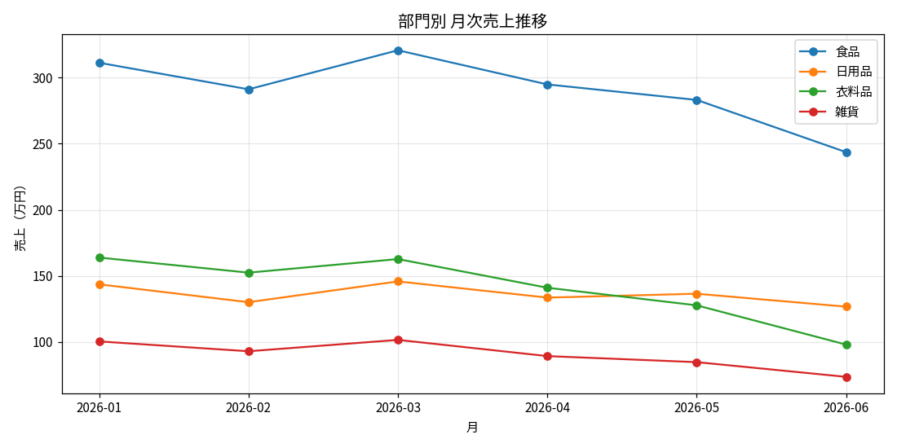
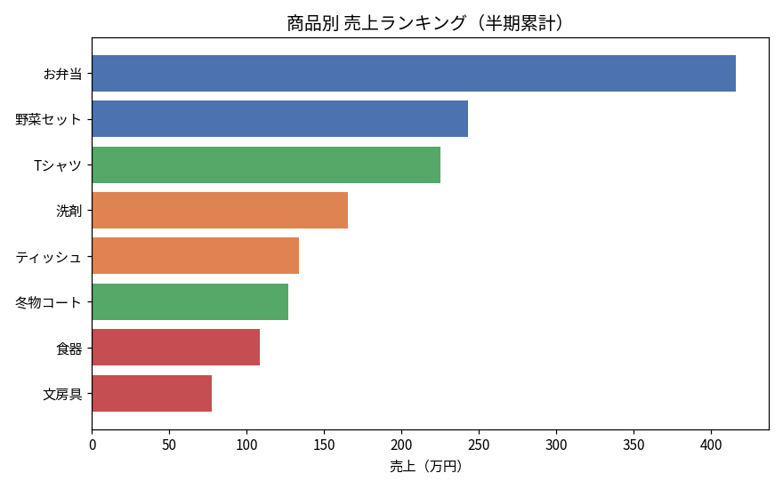

# 小売店 売上分析＆Excelレポート自動生成

小売店（複数部門を展開する想定）の売上データをもとに、**分析から定例レポート作成までを
一貫して自動化する**プロジェクトです。

前職（生産管理・品質管理）で、日次・月次の実績レポートを手作業で作成していた経験から、
「この集計作業をPythonで自動化したらどれくらい楽になるか」を実際に手を動かして検証しました。

## 使用技術

- Python 3
- pandas（データ加工・集計）
- matplotlib（可視化）
- openpyxl（Excelレポートの自動生成・グラフ埋め込み）
- Jupyter Notebook

## データについて

使用しているデータは実データではなく、`data/generate_data.py` で生成した疑似データです。
季節変動（衣料品は冬に強い、など）や曜日による売上変動を反映しつつ、
乱数シードを固定して再現可能な形にしています。

## プロジェクトの流れ

1. **分析（pandas / matplotlib）**
   - 部門別・月次売上のトレンド分析
   - 商品別売上ランキング
   - 個別商品（Tシャツ）の売上トレンド分析
2. **Excelレポート自動生成（openpyxl）**
   - 分析結果をExcelファイルに自動出力
   - 折れ線グラフ・棒グラフを自動で埋め込み
   - サマリーシートで総売上・トップ部門・トップ商品を自動表示

## 主な分析結果（サマリー）

- 食品部門が安定して最大の売上規模を持ち、店舗全体の収益の土台になっている。
- **衣料品は季節変動が大きく、冬場（1月・12月）に売上が伸びる**傾向がある。
  仕入れ・在庫計画は季節を見越して立てる必要があるという示唆が得られた。
- 商品単位では「Tシャツ」が期間後半にかけて売上を伸ばしている。

詳細は [`notebooks/sales_analysis_and_report.ipynb`](notebooks/sales_analysis_and_report.ipynb)
を参照してください。

## サンプル可視化

### 部門別 月次売上推移


### 商品別 売上ランキング


### 自動生成されたExcelレポート
[`output/sales_report.xlsx`](output/sales_report.xlsx) をダウンロードすると、
サマリー・部門別売上（グラフ付き）・商品別ランキング（グラフ付き）の3シート構成の
レポートを確認できます。

## セットアップ

```bash
pip install pandas numpy matplotlib openpyxl jupyter
python data/generate_data.py
jupyter notebook notebooks/sales_analysis_and_report.ipynb
```

## 今後やりたいこと

- 実データでの再検証
- レポート生成をFastAPIでAPI化し、CSVをアップロードすると自動でExcelレポートが
  ダウンロードできる仕組みを作る
- 前月比・前年同月比などの比較指標を追加する

## 学びメモ（lessons learned）

- `pivot_table` で部門別×月別のクロス集計を行う際、列の並び順が自動的にアルファベット順や
  出現順になってしまう点に気づき、明示的に列順を指定する必要があった。
- `openpyxl` でExcelにグラフを埋め込む際、`Reference` で参照するセル範囲とデータ実体の
  行番号がずれるとグラフが正しく描画されない点でつまずいた。ヘッダー行を含めるかどうかを
  `titles_from_data` で制御する必要があることを理解した。
- 分析（pandas/matplotlib）とレポート自動化（openpyxl）を1つのプロジェクトとしてつなげたことで、
  「分析して終わり」ではなく「日々の業務に落とし込む」ところまで意識してコードを書く経験になった。

---

このプロジェクトは、以前別々に公開していた `sales-analysis`（売上データ分析）と
`excel-report-automation`（Excelレポート自動化）を統合し、1つのストーリーとして
再構成したものです。
